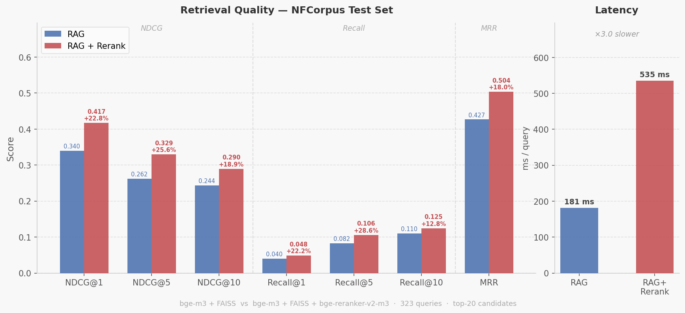

# rag_demo

An end-to-end Retrieval-Augmented Generation (RAG) system built on [NFCorpus](https://www.cl.uni-heidelberg.de/statnlpgroup/nfcorpus/) (biomedical IR benchmark), designed to study the impact of retrieval and reranking on LLM answer quality.

## Overview

This project compares three configurations on the NFCorpus question-answering task:

| System | Retrieval | Reranking | Generator |
|--------|-----------|-----------|-----------|
| Baseline | — | — | Qwen2.5-3B-Instruct |
| RAG | bge-m3 + FAISS | — | Qwen2.5-3B-Instruct |
| RAG + Rerank | bge-m3 + FAISS | bge-reranker-v2-m3 | Qwen2.5-3B-Instruct |

Evaluation covers **retrieval quality** (NDCG, Recall, MRR) comparing FAISS-only vs FAISS+rerank retrieval against NFCorpus qrels. Generation evaluation is omitted as NFCorpus provides no reference answers.

## Repository Structure

```
rag_demo/
├── data/                        # Downloaded NFCorpus splits (generated)
│   ├── corpus.jsonl
│   ├── queries.jsonl
│   └── qrels_test.jsonl
├── models/                      # Downloaded model weights (generated)
│   ├── bge_m3/
│   ├── bge_reranker_v2_m3/
│   └── Qwen2.5_3B_Instruct/
├── vector_base/                 # FAISS index + docstore (generated)
│   ├── index.faiss
│   ├── docstore.jsonl
│   └── meta.json
├── result/                      # Model outputs (generated)
│   ├── qwen2.5.jsonl            # Baseline answers
│   ├── qwen2.5_rag.jsonl        # RAG + rerank answers (with ctx_ids)
│   └── eval_retrieval.json      # Retrieval evaluation results
├── src/
│   ├── download_data.py         # Step 1: download NFCorpus
│   ├── download_models.py       # Step 2: download models from HuggingFace
│   ├── build_faiss.py           # Step 3: chunk corpus, embed, build FAISS index
│   ├── run_qwen_baseline_vllm.py        # Step 4a: baseline inference (no retrieval)
│   ├── run_qwen_rag_vllm_rerank.py      # Step 4b: RAG + rerank inference
│   └── eval_retrieval.py        # Step 5: retrieval evaluation
├── requirements.txt
└── README.md
```

## Quickstart

### Requirements

```bash
pip install -r requirements.txt
```

Requires a CUDA-capable GPU. Tested with Python 3.10+.

### Step 1 — Download data

```bash
python src/download_data.py
```

Downloads NFCorpus corpus, queries, and qrels to `data/`.

### Step 2 — Download models

```bash
python src/download_models.py
```

Downloads to `models/`:
- `BAAI/bge-m3` → embedding model
- `BAAI/bge-reranker-v2-m3` → reranker
- `Qwen/Qwen2.5-3B-Instruct` → generator

### Step 3 — Build FAISS index

```bash
python src/build_faiss.py
```

Chunks corpus by token windows (size=300, overlap=50), embeds with bge-m3, and builds a `IndexFlatIP` FAISS index. Outputs to `vector_base/`.

### Step 4a — Baseline inference

```bash
python src/run_qwen_baseline_vllm.py
```

Runs Qwen2.5-3B-Instruct on all queries without retrieval. Output: `result/qwen2.5.jsonl`.

### Step 4b — RAG + rerank inference

```bash
python src/run_qwen_rag_vllm_rerank.py
```

Full pipeline: embed query → FAISS top-20 → bge-reranker top-4 → build context → Qwen generate. Output: `result/qwen2.5_rag.jsonl` (includes `ctx_ids` and `ctx` fields).

### Step 5 — Retrieval evaluation

```bash
python src/eval_retrieval.py
```

Computes NDCG@1/5/10, Recall@1/5/10, and MRR against NFCorpus qrels. Reports scores and per-query latency for both FAISS-only and FAISS+rerank retrieval. Output: `result/eval_retrieval.json`.

## Development Plan

### Done

- [x] Data pipeline — NFCorpus download and preprocessing
- [x] Model download — bge-m3, bge-reranker-v2-m3, Qwen2.5-3B-Instruct
- [x] Indexing — token-level chunking, bge-m3 embedding, FAISS IndexFlatIP
- [x] Baseline inference — Qwen2.5-3B direct generation via vLLM
- [x] RAG + rerank inference — FAISS retrieval + bge-reranker + Qwen2.5-3B via vLLM
- [x] Retrieval evaluation — NDCG/Recall/MRR for FAISS-only vs FAISS+rerank

### Planned

- [ ] **Chunking ablation** — compare fixed-size chunking vs sentence-boundary chunking on retrieval NDCG
- [ ] **Top-k ablation** — vary retrieval depth (top-5/10/20/50) and measure NDCG@10 vs latency trade-off
- [ ] **Embedding model comparison** — bge-m3 vs a lighter model (e.g., bge-small-en)

## Key Design Decisions

**Chunking strategy**: Token-level sliding window (300 tokens, 50 overlap) rather than sentence splitting, to keep chunk length predictable for the embedding model's 512-token limit.

**FAISS index type**: `IndexFlatIP` (exact inner product search) for correctness in experiments. For production scale, `IndexIVFFlat` or `IndexHNSW` would be preferred.

**Two-stage retrieval**: FAISS retrieves top-20 candidates cheaply; bge-reranker scores all 20 pairs and selects top-4. This balances recall and precision without re-embedding.

**vLLM batching**: Queries are batched (batch=32 for RAG, 64 for baseline) to maximize GPU utilization during generation.

**No generation evaluation**: NFCorpus provides relevance judgments for retrieval but no reference answers, making reference-based metrics (ROUGE, BERTScore) inapplicable. Evaluation focuses on retrieval quality only.

## Results

Evaluated on NFCorpus test set (323 queries with qrels). FAISS retrieves top-20 candidates; reranker selects top-4 for generation.



| Metric | FAISS only | FAISS + Rerank | Delta |
|--------|-----------|----------------|-------|
| NDCG@1 | 0.3395 | 0.4169 | +22.8% |
| NDCG@5 | 0.2623 | 0.3294 | +25.6% |
| NDCG@10 | 0.2435 | 0.2896 | +18.9% |
| Recall@1 | 0.0396 | 0.0484 | +22.2% |
| Recall@5 | 0.0823 | 0.1059 | +28.7% |
| Recall@10 | 0.1104 | 0.1245 | +12.8% |
| MRR | 0.4267 | 0.5035 | +18.0% |
| Avg latency (ms/query) | 29.2 | 338.6 | +11.6x |

## References

- NFCorpus: [Boteva et al., 2016](https://www.cl.uni-heidelberg.de/statnlpgroup/nfcorpus/)
- BGE-M3: [Chen et al., 2024](https://arxiv.org/abs/2309.07597)
- BGE Reranker: [BAAI](https://github.com/FlagOpen/FlagEmbedding)
- Qwen2.5: [Qwen Team, 2024](https://arxiv.org/abs/2412.15115)
- vLLM: [Kwon et al., 2023](https://arxiv.org/abs/2309.06180)
